# 1

The cat and touch commands in Linux are used for different purposes:


- cat: Used to view the contents of a file or create a new file by typing the content manually into it.


Example (creating a file using cat):
bash


cat > myfile.txt
Hello, this is a new file!
Ctrl+D  # Press Ctrl+D to save and exit
This will create myfile.txt with the content you typed.


- touch: Used to create an empty file or update the timestamp of an existing file.

Example (creating a file using touch):
bash


touch myfile.txt
This will create an empty file called myfile.txt.


In summary:
cat is used to create a file with content or view the contents of a file.
touch is used to create an empty file or update file timestamps.

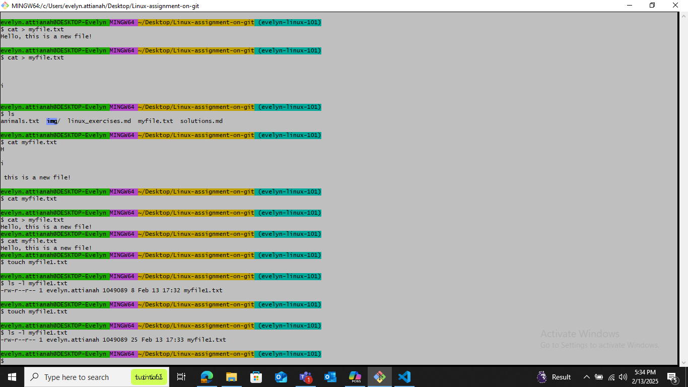


# 2

1. File permissions in Linux:


- File permissions determine who can read, write, or execute a file.
- Displaying file permissions:
  - ls -l to list files with permissions.
  - stat filename to display detailed file information.


2. Default permissions:


- Files: rw-r--r-- (644)
- Folders: rwxr-xr-x (755)
- 
3. Create a folder in Linux:

**mkdir newfolder**
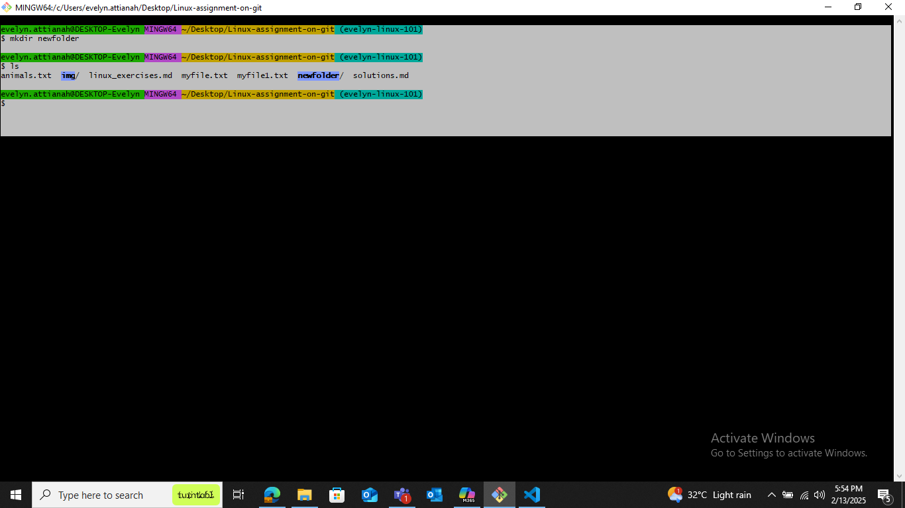


# 3

1. Command to print the number of lines, words, and characters in a file:

- The command you need is wc (word count).
Usage:
wc filename
Apply the command to animals.txt:

2. Assuming you have animals.txt in your current directory, you can use:


wc animals.txt


- This command will output the number of lines, words, and characters in the animals.txt file. 

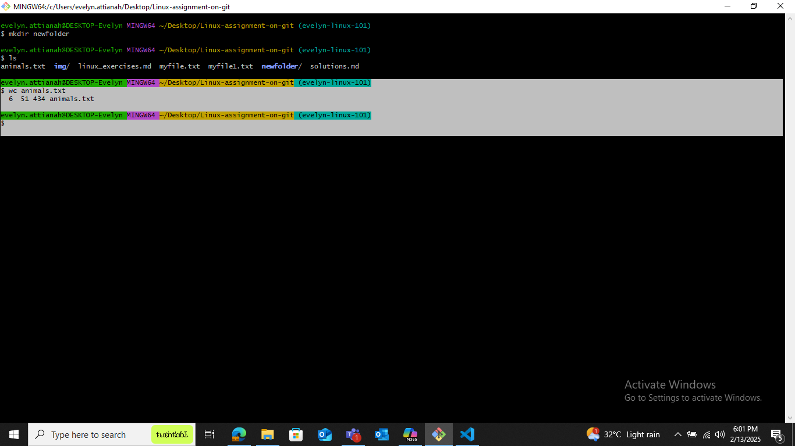


# 4

You can achieve this using a combination of head and wc commands in Linux. Here's how you can do it:

- Get the first 3 lines of animals.txt:


head -n 3 animals.txt


- Count the words in the first 3 lines:

head -n 3 animals.txt | wc -w


The first command will display the first 3 lines of the file, and the second command will count the words within those lines.
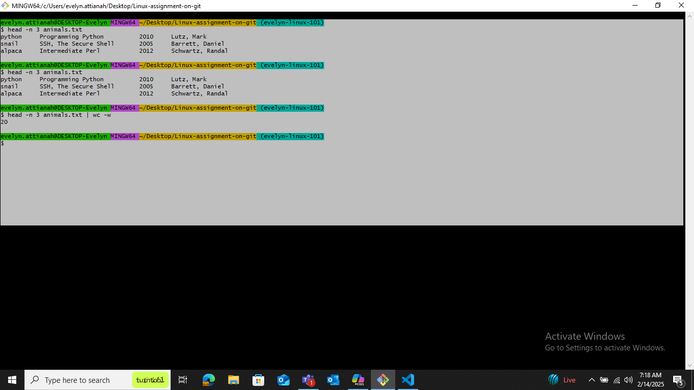


# 5

The Linux command that starts with "g" and is used for searching through files is grep.

- To search for the words Nutshell, Perl, and Dansoman in animals.txt, use the following command:


**grep -E 'Nutshell|Perl|Dansoman' animals.txt**


Alternatively, you can use three separate grep commands:


**grep 'Nutshell' animals.txt**


**grep 'Perl' animals.txt**


**grep 'Dansoman' animals.txt**


If you want a case-insensitive search, use:


**grep -iE 'Nutshell|Perl|Dansoman' animals.txt**
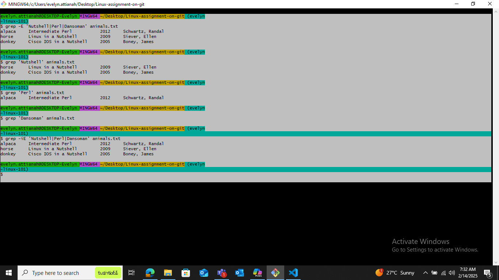

# 6

Command to list all files in a directory:


**ls**

To show hidden files as well:

**ls -a**


To display details (permissions, owner, size, etc.):


**ls -l**


To sort by modification time:


**ls -lt**

What is a directory in Linux?


A directory in Linux is just a folder that contains files and other directories (subdirectories). It helps in organizing files.


Example: **/home/user/Documents** is a directory that holds document files.
The root directory / is the topmost directory in Linux, containing everything.
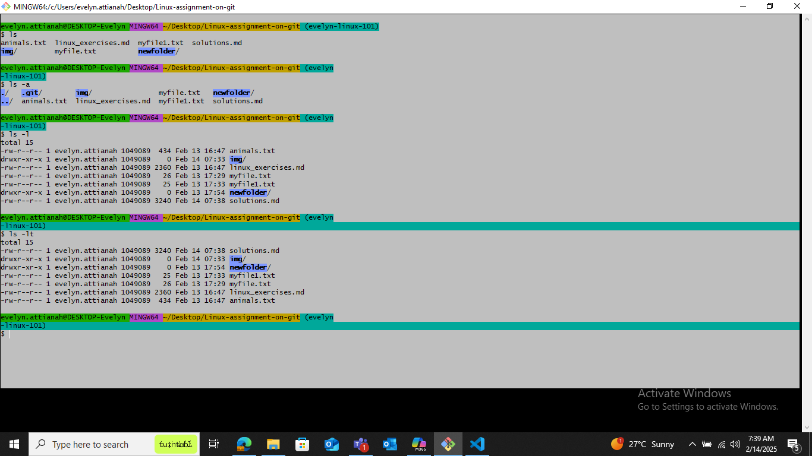


# 7

 What is the pwd command? What does it do?

**pwd** stands for Print Working Directory.
It shows the absolute path of the current directory you're in.
Example:

pwd

Output:

**/home/user/Documents**

This means you are currently in the Documents directory.


What is the difference between echo and cd?

- echo: Displays (prints) text or variables in the terminal.


**echo "Hello, world!"**
Output:

**Hello, world!**

- cd (Change Directory): Moves you to a different directory.

**cd /home/user/Documents**

This command takes you to the Documents folder.

Key Difference:

echo just prints text.
cd is used for navigation between directories.
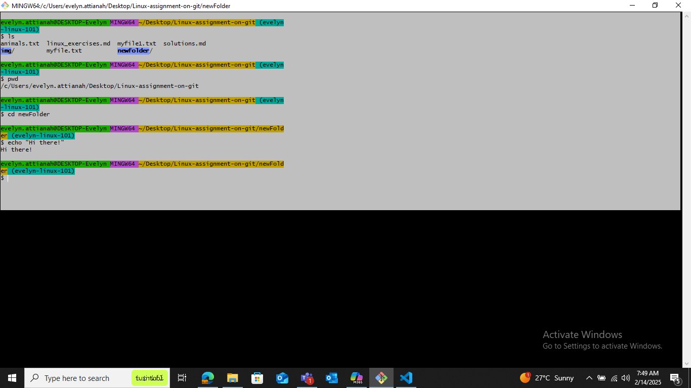

# 8

- What is the dirs command in Linux?

The dirs command displays the list of directories you have navigated using the pushd and popd commands.
It is mainly used with the directory stack, which helps in quickly switching between directories.
Example:

**dirs**
Output:

**/home/user/Documents /var/log /etc**

This shows the directories in the stack.

- How to find out more about the mv command?

Use the man (manual) command to read the documentation:

**man mv**

Or use --help for a quick summary:

**mv --help**

The mv command is used to move or rename files.
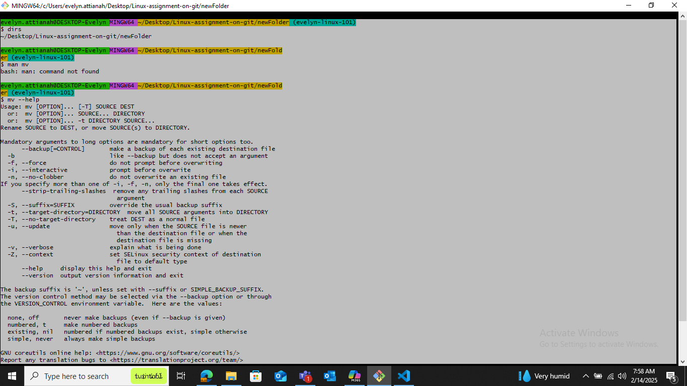


# 9

- Using the date command to print the current day:

**date +"%A"**

This will display the current day of the week, e.g.:

**Friday**

- Difference between awk and grep commands:

| Feature| grep	| awk |
| -- | -- | -- |
| Purpose	| Searches for patterns in a file |	Searches, processes, and manipulates text |
| Functionality |	Only finds and highlights matches | Can filter, format, and perform calculations |
| Output | Prints matching lines | Prints specific columns, modifies output, does calculations |

Examples:

grep example (Find all lines with "error" in a log file):

**grep "error" system.log**


awk example (Print only the second column of a space-separated file):


awk '{print $2}' data.txt
If data.txt contains:


1. Apple
2. Banana
3. Cherry


The output will be:


Apple

Banana

Cherry

Key Difference:

- grep searches for specific words or patterns.
- awk processes text, allowing filtering, formatting, and even calculations.

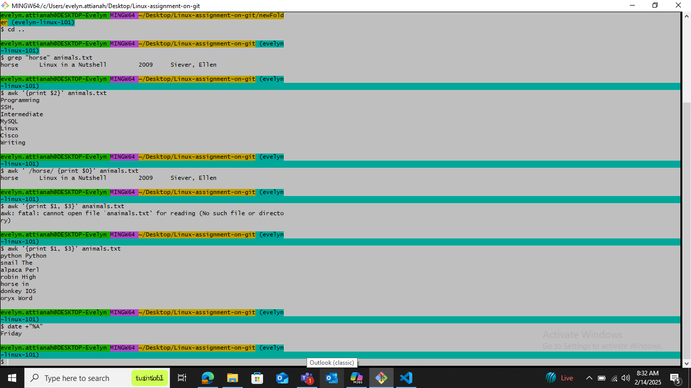


# 10

Let's go through your questions:

1. **Environment Variables:**
   Environment variables are dynamic values that affect the processes or programs on a computer. They can store information such as the location of system files, user preferences, and system settings. Environment variables are used by the operating system and applications to customize their behavior.

   To list all environment variables in your terminal, you can use the `printenv` or `env` command:
   ```
   printenv
   ```
   or
   ```
   env
   ```

   Here are 5 common environment variables:
   - `PATH`: Specifies the directories in which executable programs are located.
   - `HOME`: The home directory of the current user.
   - `USER`: The username of the current user.
   - `SHELL`: The path to the current user's shell.
   - `LANG`: Defines the language and locale settings.

2. **Difference between `more` and `less` commands:**
   - **`more` command:**
     The `more` command is used to view the contents of a file one screen at a time. It allows you to scroll through the file, but only in a forward direction. For example:
     ```
     more filename.txt
     ```
     This command will display the contents of `filename.txt` one screen at a time.

   - **`less` command:**
     The `less` command is similar to `more`, but it provides more functionality. It allows you to scroll both forward and backward through the file. It also has additional features like searching within the file. For example:
     ```
     less filename.txt
     ```
     This command will display the contents of `filename.txt` with the ability to navigate both forward and backward.

In summary, `more` is a simpler pager that only allows forward navigation, while `less` is more advanced and allows both forward and backward navigation, along with additional features.
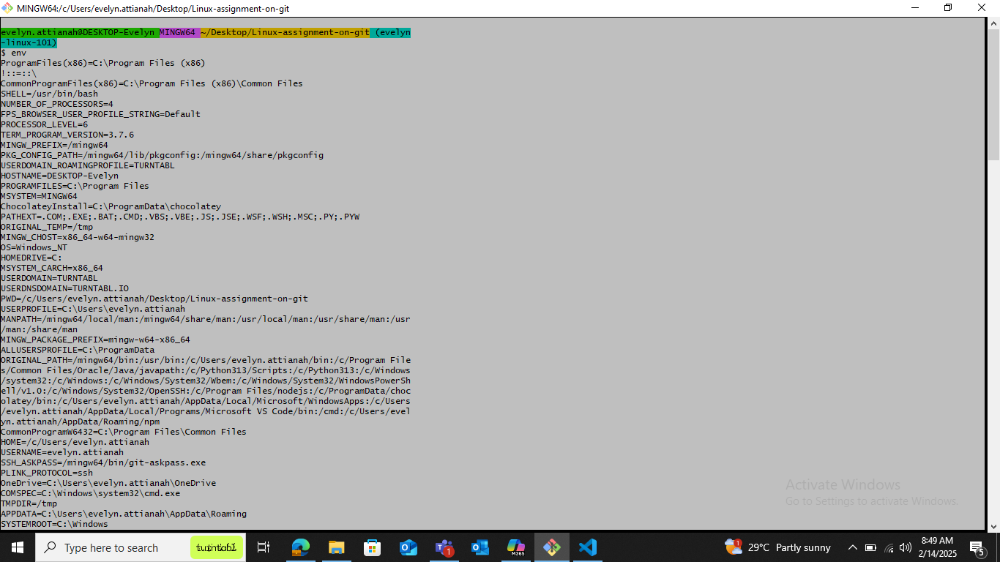
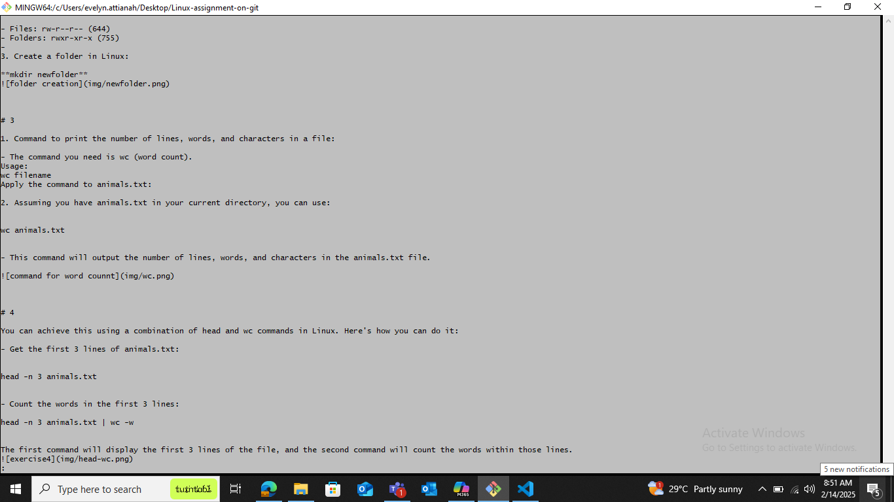
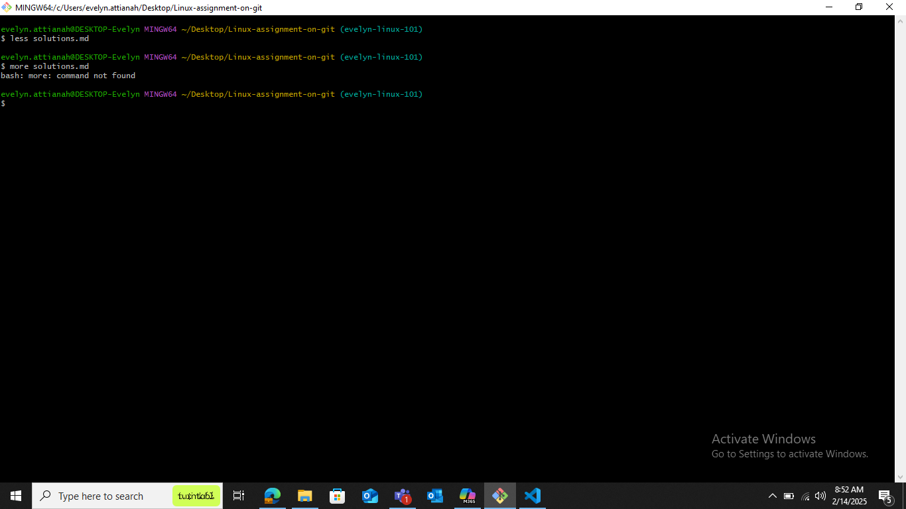


# 11

The command you're looking for is `file`. The `file` command is used to determine the type of a file. It examines the file and provides information about its type, such as whether it's a text file, binary file, image, etc.

For example, to see the type of a file named `example.txt`, you would use:
```
file example.txt
```

This command will output something like `example.txt: ASCII text`, indicating that `example.txt` is a text file.

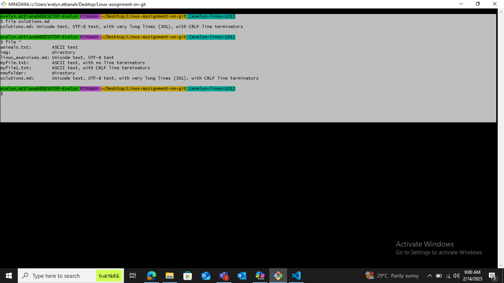


# 12

The Unix filesystem tree is called the **root filesystem**. It is structured as an inverted tree, with the root directory (`/`) at the top. Here are three important folders in this tree:

1. **`/bin`**: Contains essential binary executables (programs) needed for the system to boot and run in single-user mode. Examples include basic commands like `ls`, `cp`, and `mv`.

2. **`/etc`**: Contains system configuration files. This directory holds important configuration files and scripts used to control the system's behavior, such as `passwd` (user account information) and `fstab` (filesystem table).

3. **`/home`**: Contains the home directories for all users. Each user has a subdirectory within `/home` where their personal files and settings are stored.


# 13

Sure! The `head` and `tail` commands are used to display the beginning and end of files, respectively. Here's how you can use them in the Git Bash terminal:

1. **`head` command:**
   The `head` command displays the first few lines of a file. By default, it shows the first 10 lines, but you can specify a different number of lines using the `-n` option. For example:
   ```
   head -n 5 filename.txt
   ```
   This command will display the first 5 lines of `filename.txt`.

2. **`tail` command:**
   The `tail` command displays the last few lines of a file. By default, it shows the last 10 lines, but you can specify a different number of lines using the `-n` option. For example:
   ```
   tail -n 5 filename.txt
   ```
   This command will display the last 5 lines of `filename.txt`.

These commands are useful for quickly viewing the beginning or end of a file without opening the entire file.
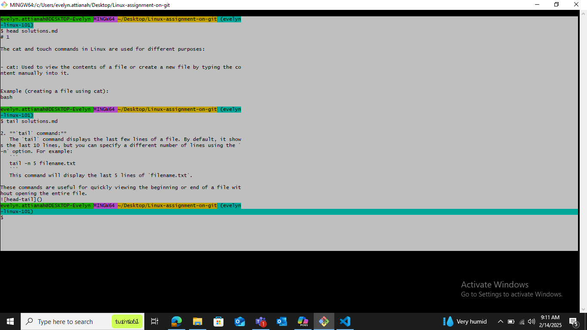

`DONE`